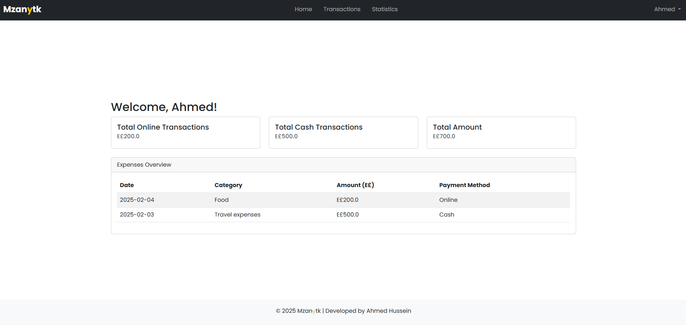

# **Mzanytk - Personal Finance Tracker**

#### 📹 Video Demo:  [Click Here](<[URL HERE](https://youtu.be/Midxo5ZdwKk)>)

## 📌 **Overview**
**Mzanytk** (an Arabic word meaning _"Your Budget"_) is a **personal finance tracker** designed to help users efficiently **track their expenses**, **analyze spending habits**, and **visualize financial trends**. It provides a user-friendly dashboard where users can:

- Record transactions with categories and payment methods.
- Gain insights into their financial behavior through **charts and analytics**.
- Export transaction history in **CSV format** (supports Arabic text).
- View **spending breakdown by category and payment method**.
- Utilize a **dark mode interface** for better readability.

## 🚀 **Features**
✔ **Secure User Authentication** (Register & Login system)
✔ **Track & Categorize Expenses**
✔ **Visualize Spending Trends** (Interactive graphs & charts)
✔ **Download Transactions in CSV Format** (Arabic text supported)
✔ **Simple & Clean Dashboard Overview**

## 🛠️ **Tech Stack**
- **Backend:** Flask (Python) with SQLite database
- **Frontend:** HTML, CSS, Bootstrap (via CDN), JavaScript
- **Visualization:** Chart.js for interactive financial data

---

## 📂 **Project Structure**
```plaintext
project/
│-- app.py               # Flask backend (handles authentication, transactions, statistics, and database interactions)
│-- finance.db           # SQLite database storing user and transaction data
│-- requirements.txt     # Python dependencies
│-- static/
│   ├── bootstrap.min.css # Bootstrap CSS file (included locally)
│-- templates/
│   ├── layout.html      # Base layout template (Navbar, Footer, etc.)
│   ├── index.html       # Home page with summary cards & transactions table
│   ├── login.html       # User login page
│   ├── register.html    # User registration page
│   ├── statistics.html  # Spending analytics with charts & tables
│   ├── transaction.html # Transaction management (add, delete transactions)
│-- README.md           # Project documentation
```

## 📊 **How It Works**
1. **Login/Register** to your account.
2. **Add transactions** with categories and payment methods.
3. **View expenses** in tables and interactive charts.
4. **Download transaction history** in CSV format (supports Arabic text).

---

## 🖼️ **Screenshots**
### 🏠 **Home Page**


### 📊 **Statistics Page**


---

## 📝 **Requirements**
- ✅ **Python 3.8+**
- ✅ **Flask**
- ✅ **SQLite3**
- ✅ **Bootstrap (via CDN)**
- ✅ **Chart.js**

---

## 🛠️ **API Endpoints**
| **Route**                | **Method** | **Description** |
|--------------------------|------------|-----------------|
| `/`                      | `GET`      | Home Page |
| `/login`                 | `GET/POST` | User Login |
| `/register`              | `GET/POST` | User Registration |
| `/transactions`          | `GET`      | View Transactions |
| `/add_transaction`       | `POST`     | Add a new transaction |
| `/delete_transaction/<id>` | `POST`   | Delete a transaction |
| `/statistics`            | `GET`      | View spending analytics |
| `/download_csv`          | `GET`      | Export transactions as CSV |

---

## 📌 **Credits**
👨‍💻 Developed by **Ahmed Hussein** - 2025
🔗 **GitHub Repository**: [Link Here](https://github.com/218AHM/mzanytk-finance-tracker)

## 🔗 **License**
📜 This project is **open-source** and available under the **MIT License**.
